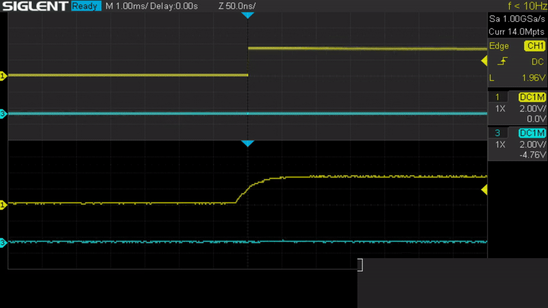
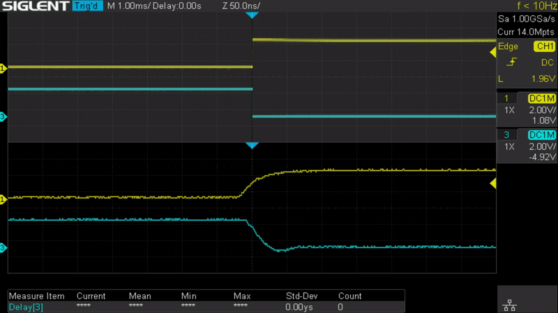

# Embedded GPS PTP Timeserver

A GPS-referenced Stratum 1 network time server with support for Precision Time Protocol (PTP, IEEE 1588) and NTPv4 (RFC 5905).

This implementation is entirely bare metal, all of the code in this repo was written from scratch for the STMicroelectronics NUCLEO-H563ZI platform.

## Dependencies:

* arm-none-eabi-*
* openocd-stm

To build, run `make` from the top level directory.\
To flash, run `make flash` from the top level directory.

## Overview (TODO)

## Platform

### Hardware
This project was built for the STMicroelectronics NUCLEO-H563ZI. This board features an Arm Cortex-M33 running at (up-to) 250MHz and 100 Mbps Ethernet with hardware timestamping support (for IEEE 1588 PTP)

The main 32.768 kHz crystal oscillator is quite unstable, making accurate time-keeping over long durations impossible. I plan to replace it with a TCXO at some point in the future.

### Timing

The Ethernet MAC contains a hardware timer used to timestamp PTP packets as they enter/leave the device. This timer can also be modified by software and is used as the authoritative time source when generating NTP packets.

### GPS

UTC time is received via GPS module (I use a ublox LEA-5T) over serial (USART2). The PPS signal triggers a snapshot of the PTP timestamp timers which are used to calculate the current time offset. The frequency divider driving the system timer is then adjusted using a PI controller to smoothly align the system time to UTC time.

\
*A demo of the system time synchronizing with GPS. The yellow trace is the PPS reference from GPS. The blue trace is the PPS signal originating in the Ethernet MAC. The components of the PI controller can be seen in the bottom right.*

The frequency drift of the main clock (and maybe also the GPS receiver) is quite noticeable at steady-state.

\
*Clock drift at steady state (10x speed)*

This data was collected with a piece of foam covering the MCU and external XO. I think a large amount of the drift is caused by trying to use GPS indoors and not a bad crystal oscillator.

### Networking (Ethernet)

Custom netcode receives packets from the internet and passes them to a dedicated timeserver process.

This process will provide time to network clients over either NTP or Layer3 PTP(TODO)

L2 PTP is handled automatically in the Ethernet MAC of the STM32H563

### RTOS

This app runs on a custom RTOS supporting priority-based round-robin task scheduling.\
Various primitives such as blocking semaphores and multi-thread safe FIFOs are included.\
It also includes custom heap management using buddy allocation.\
Custom netcode allows passing network traffic to multiple separate processes based on protocol/port mappings.\
A command interpreter is exposed on the STLINK-V3EC Virtual COM port (USART3) by default. However, the serial interface used can be easily changed.\
This interpreter exposes various OS statistics and information on the running application(s).

---

## Implementation details (under construction)

More details about implementing each component can be found in the respective readme's linked below:

[Hardware PTP timers](docs/hardware_timers.md)

[Synchronizing time with GPS](docs/gps_sync.md)

[Ethernet](docs/ethernet.md)

[Timeserver](docs/timeserver.md)

[RTOS](docs/rtos.md)

[System clock configuration](docs/clocks.md)

---

## References / Resources:

[STMicroelectronics/OpenOCD](https://github.com/STMicroelectronics/OpenOCD)

[IEEE 1588-2012 Standard](https://standards.ieee.org/ieee/1588/4355/)

[STM32H563 Reference Manual](https://www.st.com/resource/en/reference_manual/rm0481-stm32h52333xx-stm32h56263xx-and-stm32h573xx-armbased-32bit-mcus-stmicroelectronics.pdf) (RM0481)

[STM32H563 Datasheet](https://www.st.com/resource/en/datasheet/stm32h562ag.pdf) (DS14258)

[PID Without a PhD](https://www.wescottdesign.com/articles/pid/pidWithoutAPhd.pdf)
